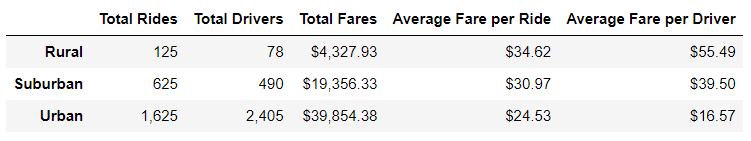
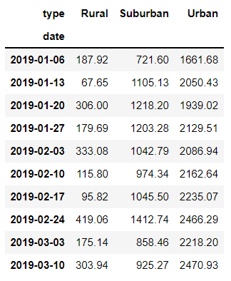
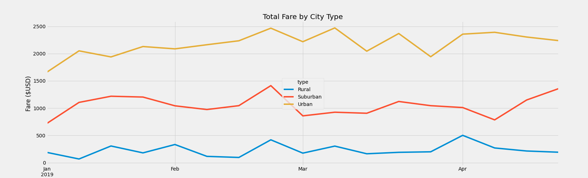

#### Challenge 5: Module 5

# Overview of Project

## Overview of the PyBer Analysis

The main purpose of Challenge 5 is to obtain a complete analysis of the ride sharing data by city type and then create a plot using the total fares by week. The summary data frame will show the exact information needed for V. Isualize to see the differences in fares between the three city types: Urban, Suburban and Rural, and compare them by week. The graph will help to see that information easily and will make the differences more notable. All the results have the purpose of being a future instrument for decision making in PyBer. Some tools used for the analysis were matplotlib and pandas.

## Results

* Data Frame

The data of the results were obtained from two csv files that were merged. The next step was to obtain the total number of rides, drivers and amount of fares for each city type with the groupby process. The average fare per ride and per driver for each city type were calculated using the obtained values already described, the total amount of fares divided by the total number of rides or drivers. All those results were used to create a new data frame named PyBer Summary, that can be seen in Image 1.

###### Image 1. PyBer Summary.

The most notable difference between the results is that urban cities have the higher number of total rides and drivers, and therefore of total fares. At the same time, those cities have the minimum average fare per ride and driver. So it can be said that there is a relation between the number of rides and drivers with the average fare. The total fare from rural cities is below the others but the number of rides and drivers is also minimum, making the results of the division higher.

* Total Fare by City Type Plot
* 
The final step was the creation of a plot from the data merged at the beginning. The data was first filtered to obtain a data frame using the groupby process, where the values were the sum of the fares for each city type and date. The index from that new data frame was reset for the creation of a pivot table with date as the index, columns as the types of the cities and fares being the values. A new data frame was created from the pivot table, having just the values from January 1st, 2019 to April 29th, 2019. The index was changed to date time datatype and the resample function was used to get the sum of the fares by week. The final data frame is in Image 2.

###### Image 2. New data frame for the plot (first 10 rows) 

In this case, the data frame shows the first 10 rows, where it can be seen that in most of the cases, the number of fares in urban cities is quite higher than the others, as in the first data frame. It can also tell that there is a relation between the week, because the three of them had higher and lower numbers at the same date.
The total fares of urban cities never went above $1500 USD, while suburban cities maintained between $750- 1500 USD approx. and rural cities stayed above $500 USD. These numbers can tell that each city will go up and down within a range and that the type of city determined that range. The plot from Image 3. helped to visualize the big differences in fares from each city and the peaks from each week in the three different types.

###### Image 3. Total Fare by City Type

## Summary

The results from the complete analysis gave an idea of new possible changes in fares. The first point to underline is that urban cities have a higher number in rides and drivers, that number is quite huge compared to the other city types. The different result that can be verified is that rural cities have the highest average fares. If it is analyzed mathematically, the results are completely correct, but if someone goes deep in the context, the result can be confused. It can be confusing because there is more money in urban cities than rural, so the services could have lower fares for rural citizens. It could also be unfair that driver salaries from urban cities are limited, making that profession not useful for people to have a quality life.

